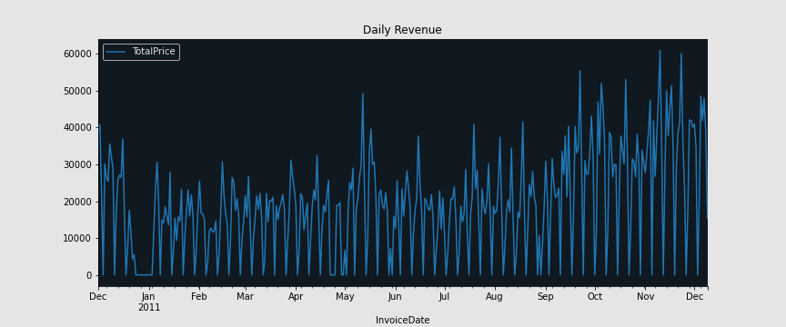

# Ecommerce 
E-commerce (electronic commerce) is the buying and selling of goods and services, or the transmitting of funds or data, over an electronic network, primarily the internet. These business transactions occur either as business-to-business (B2B), business-to-consumer (B2C), consumer-to-consumer or consumer-to-business.

<h2>How does e-commerce work?</h2>
E-commerce is powered by the internet, where customers can access an online store to browse through, and place orders for products or services via their own devices.

As the order is placed, the customer's web browser will communicate back and forth with the server hosting the online store website. Data pertaining to the order will then be relayed to a central computer known as the order manager -- then forwarded to databases that manage inventory levels, a merchant system that manages payment information (using applications such as PayPal), and a bank computer -- before circling back to the order manager. This is to make sure that store inventory and customer funds are sufficient for the order to be processed. After the order is validated, the order manager will notify the store's web server, which will then display a message notifying the customer that their order has been successfully processed. The order manager will then send order data to the warehouse or fulfillment department, in order for the product or service to be successfully dispatched to the customer. At this point tangible and/or digital products may be shipped to a customer, or access to a service may be granted.

<h2>Dataset</h2>

This is a transnational data set which contains all the transactions occurring<b> between 01/12/2010 and 09/12/2011</b> for a UK-based and registered non-store online retail.The company mainly sells unique all-occasion gifts. Many customers of the company are wholesalers.

Per the UCI Machine Learning Repository, this data was made available by Dr Daqing Chen, Director: Public Analytics group. chend '@' lsbu.ac.uk, School of Engineering, London South Bank University, London SE1 0AA, UK.

<h2>Information acquired from the Data</h2>
Data consist of <b>392735 rows and 9 columns</b> from where <b>Total Price</b> and <b>Invoice date</b> is only taken for prediction.

<h3>First of all we find product with highest sales</h3>

From the figure we can see that the highest sales is for the product <b>"jumbo bag red retrospot"</b> and quantity of sales is: <b>30251</b>
  
<h3>Weekly Revenue </h3>

From the revenue per week graph we can interpret that:

1)The online retail was close on January.

2)It had its first peak on mid of May.

3)2nd peak on October.

4)Highest sales in mid of November.

From the bar graph we can see that <b>40%</b> of the people shopped within the limits <b>70000-120000</b> per week.

<h3>Daily Revenue</h3>

We can see that daily revenue for the month of <b>January</b> is <b>0</b>. We can conclude that the shop was closed on <b>January</b>.

<b>17.5%</b> which is the majority of customers shopped for less than <b><10000</b> daily.

<h2> Conclusion </h2>
After applying the algorithm <b>Fbprophet</b> as the data was <b>Time-series</b>.

Daily revenue forcast for Future sales.

The black dots is the given revenue, the blue lines are the predicted revenue.
<h2>Accuracy </h2>
<h3>For Training set:</h3> 

<b>R2</b>: 0.7458534620919863
<b>MSE</b>: 34621963.87027395
<b>Correlation</b>: 0.8643112216761973

<h3>For Validation set:</h3> 

<b>R2</b>: 0.7028742317443533
<b>MSE</b>: 75077966.7453437
<b>Correlation</b>: 0.8585158123805817
